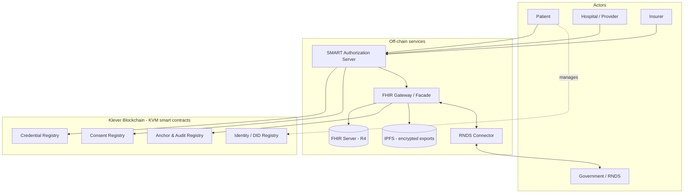
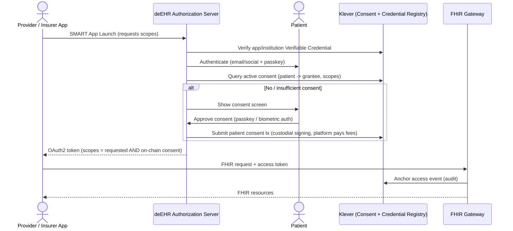

# deEHR — Decentralized Electronic Health Record

> An open-source Electronic Health Record platform where **patients truly own their health data** — built on the **FHIR / SMART** healthcare standards, with data authenticity, consent and ownership **certified on the Klever blockchain**.


🌐 **Languages / Idiomas:** **English** · [Português (Brasil)](README.pt-BR.md)

> ⚠️ **Project status:** Early planning. This README is the project's anchor document and is expected to evolve. Architecture, scope and roadmap are open for discussion — see [Contributing](#-contributing).

---

## Table of Contents

- [Vision](#-vision)
- [The Problem](#-the-problem)
- [The deEHR Approach](#-the-deehr-approach)
- [Core Principles](#-core-principles)
- [Standards & Building Blocks](#-standards--building-blocks)
- [Architecture](#-architecture)
  - [Off-chain vs. On-chain](#off-chain-vs-on-chain)
  - [System Overview](#system-overview)
  - [Identity & Key Management — "Progressive Custody"](#identity--key-management--progressive-custody)
  - [What Lives on Klever](#what-lives-on-klever)
  - [The SMART ↔ Blockchain Bridge](#the-smart--blockchain-bridge)
  - [Data Storage — Hybrid Model](#data-storage--hybrid-model)
- [Actors & Use Cases](#-actors--use-cases)
- [RNDS & Government Integration](#-rnds--government-integration)
- [Roadmap](#-roadmap)
- [Tech Stack](#-tech-stack)
- [Project Structure](#-project-structure)
- [Security & Compliance](#-security--compliance)
- [Contributing](#-contributing)
- [License](#-license)
- [References & Acknowledgements](#-references--acknowledgements)

---

## 🩺 Vision

Health records today are scattered across hospitals, clinics, labs and insurers — each a silo, none owned by the person the data is actually about. When a patient changes provider, moves city, or needs a second opinion, their history rarely travels with them.

**deEHR** flips the ownership model. The **patient is the custodian and owner** of their health record. Hospitals, insurers and government systems become *participants* that read and write to the patient's record **only with verifiable, on-chain consent**.

Our goal is a production-grade, open-source platform that is:

- **Standards-native** — interoperable by design via [HL7 FHIR](https://hl7.org/fhir/) and [SMART App Launch](https://docs.smarthealthit.org/).
- **Trust-anchored** — data integrity, consent and ownership certified on the [Klever blockchain](https://ai.klever.org/).
- **Government-ready** — integrates with national health backbones, starting with Brazil's [RNDS](https://rnds-guia.saude.gov.br/).
- **Easy for everyone** — including elderly patients. No crypto jargon, no seed phrases.

## ❓ The Problem

| Pain point | Today | With deEHR |
| --- | --- | --- |
| **Ownership** | Data is owned by whichever institution captured it. | The patient owns the record; institutions are guests. |
| **Portability** | History is locked in proprietary systems. | A portable, encrypted FHIR record follows the patient. |
| **Consent** | Consent is paper-based or buried in T&Cs; hard to audit or revoke. | Consent is an explicit, signed, revocable, **on-chain** event. |
| **Integrity** | No way to prove a record wasn't altered after the fact. | Every record is hash-anchored on a public ledger. |
| **Trust between parties** | Hospitals and insurers don't trust each other's data. | Authenticity is cryptographically verifiable by anyone. |
| **Interoperability** | Custom point-to-point integrations everywhere. | One FHIR-native API; one consent model. |

## 💡 The deEHR Approach

The architecture follows a principle confirmed by both academic research and the Brazilian healthcare-IT practitioners who shaped these requirements:

> **Protected Health Information (PHI) never goes on the blockchain.**
> Encrypted **FHIR** resources are stored **off-chain**. The blockchain stores only **proofs**: integrity hashes, consent receipts, access events and identity/credential records.

This matches the guidance gathered from an Amil CTO:

1. *"Anchor and validate the data on-chain, and store it off-chain already in FHIR format."* → **Anchor Registry** + off-chain FHIR storage.
2. *"We need a study of how to anchor identity and chain validation with SMART, to pass validated scopes to the API."* → The **SMART ↔ Blockchain Bridge** (consent-gated token issuance).
3. *"SMART does Auth on top of OpenID — we need an on-chain layer to guarantee authenticity, certification and ownership."* → **DID identity + Verifiable Credentials + on-chain Consent Registry**.

deEHR is, to our knowledge, the first project to combine **production-grade SMART on FHIR authorization**, **on-chain consent as the source of truth**, **low-fee Klever anchoring**, and a **real national backbone (RNDS)** — while keeping the experience as simple as a mainstream consumer app.

## 🧱 Core Principles

1. **Patient-owned by default.** The patient is the root of consent and ownership.
2. **No PHI on-chain — ever.** A hard architectural invariant, enforced in code review and audits.
3. **Standards over invention.** FHIR R4 and SMART App Launch are the contract; the blockchain augments them, it does not replace them.
4. **Blockchain is invisible.** Patients log in with email/social + biometrics. No wallets, seed phrases or gas — ever, unless they opt in.
5. **Consent is explicit, signed and revocable.** Every grant and revocation is an auditable on-chain event.
6. **Open source & auditable.** MIT-licensed. Security audit is **mandatory** before every release.
7. **Accessibility first.** Elderly and low-digital-literacy patients are first-class users.
8. **Sovereignty-aware.** Built to integrate with — not bypass — national health systems and data-protection law (LGPD).

## 📚 Standards & Building Blocks

| Building block | Role in deEHR | Reference |
| --- | --- | --- |
| **HL7 FHIR R4** | Canonical data model for all clinical records. | [hl7.org/fhir](https://hl7.org/fhir/) |
| **SMART App Launch 2.x** | OAuth2/OIDC authorization for apps and services; scoped, least-privilege access. | [docs.smarthealthit.org](https://docs.smarthealthit.org/) |
| **SMART Backend Services** | Server-to-server FHIR access (institution ↔ institution). | [HL7 SMART](https://hl7.org/fhir/smart-app-launch/backend-services.html) |
| **OAuth 2.0 / OpenID Connect** | Underlying auth framework; `id_token`, `fhirUser` claim. | [oauth.net](https://oauth.net/2/) |
| **WebAuthn / FIDO2 (passkeys)** | Passwordless, biometric login to the deEHR platform (an off-chain authentication factor). | [w3.org/TR/webauthn](https://www.w3.org/TR/webauthn-2/) |
| **W3C DID & Verifiable Credentials** | Decentralized identity for patients, providers and institutions. | [w3.org/TR/did-core](https://www.w3.org/TR/did-core/) |
| **Klever Blockchain (KVM)** | Anchoring, consent, identity and credential registries via Rust/WASM smart contracts. | [klever.org](https://klever.org/) |
| **IPFS** | Decentralized storage for encrypted, patient-held record exports. | [ipfs.tech](https://ipfs.tech/) |
| **RNDS (Brazil)** | National health data network — first government backbone integration. | [rnds-guia.saude.gov.br](https://rnds-guia.saude.gov.br/) |

## 🏗 Architecture

### Off-chain vs. On-chain

| Layer | Stores | Examples |
| --- | --- | --- |
| **Off-chain** (encrypted) | All clinical data | FHIR resources, documents, lab results, images |
| **On-chain** (Klever) | Proofs only — never PHI | Integrity hashes, consent grants/revocations, access audit events, DIDs, credential status |

### System Overview



### Identity & Key Management — "Progressive Custody"

This is where deEHR is deliberately different. **Self-custody with seed phrases is a barrier**, not a feature, for ordinary people — and elderly patients are a primary audience. deEHR decouples *how a patient logs in* from *how on-chain transactions are signed and paid for*, using a **custodial-by-default key model** layered on Klever's native **account-permission system** (weighted multi-signer accounts with thresholds):

| Concern | How deEHR handles it |
| --- | --- |
| **Login** | Email or social login (OIDC) + a **passkey** (WebAuthn/FIDO2). Biometric unlock. No passwords to forget, no seed phrases to lose. The passkey is an **off-chain authentication factor** — it authenticates the patient to the deEHR platform; it does not sign Klever transactions directly. |
| **On-chain account** | A standard Klever account whose signing key is, by default, **custodied by the deEHR platform** (HSM-backed) and never exposed to the patient. Klever's native account permissions let the signer set and threshold evolve over time without changing the account address. |
| **Identity** | A `did:klever:…` DID with an on-chain DID Document. The patient gets DID portability and verifiability **without managing any DID plumbing** ("DID-lite"). |
| **Recovery** | **Social recovery** built on Klever's native weighted-multisig permissions — guardians (e.g. a family member, the primary-care provider, the platform) are registered as signers on a recovery permission with an M-of-N threshold (e.g. 2-of-3) to restore access on a lost device. |
| **Data keys** | PHI encryption keys are **guardian-backed** too — losing a phone must never mean losing your health record. |
| **Fees** | Patients never hold KLV or pay gas. Klever has no native gasless/meta-transaction primitive, so deEHR runs a **platform-operated signing & fee service** that submits patients' transactions and covers the network fees from a platform treasury. |
| **Custody spectrum** | Default = **assisted custody** (platform-held key + guardian recovery, like a bank). Power users may **progressively take over** — adding their own device key as a signer, reducing the platform's permission, and ultimately exporting to a self-custodied Klever wallet. Progressive, never forced. |

**Net effect:** logging into deEHR feels like any modern app. The blockchain is *invisible infrastructure* — until the patient wants to look under the hood.

> **Implementation note.** Klever KVM does not provide ERC-4337-style account abstraction, on-chain WebAuthn/passkey (secp256r1) signature verification, native account guardians, or native gasless transactions. deEHR's "Progressive Custody" is therefore an **application-layer construction** built on Klever's native account-permission (weighted multisig) system plus a platform-operated key-custody and fee service. This makes that service security-critical; its design is specified in ADR-0001 (Identity & Key Management), established in Phase 0.

Institutions (hospitals, insurers) also receive DIDs, plus **Verifiable Credentials** issued by recognized authorities (e.g. CFM/CRM for physician licenses, ANS for insurers, CNES for facilities). These credentials are what let the authorization server distinguish a real accredited hospital from an impostor.

### What Lives on Klever

Klever smart contracts are written in **Rust** and compiled to **WebAssembly** for the **KVM (Klever Virtual Machine)**. deEHR's on-chain layer is a set of registries:

| Registry | Responsibility |
| --- | --- |
| **Identity / DID Registry** | DID Documents, key-rotation history, guardian/recovery signer sets. |
| **Credential Registry** | Issuance and revocation **status** of Verifiable Credentials (hashes only — never the credential body). |
| **Consent Registry** | Patient-signed consent grants: grantee DID, scope set, resource filter, purpose-of-use, expiry. Every grant/revoke is an event. **Source of truth for authorization.** |
| **Anchor & Audit Registry** | Integrity hashes of encrypted FHIR bundles + IPFS CIDs; tamper-evident log of every data-access event. |

### The SMART ↔ Blockchain Bridge

The novel piece: the **SMART authorization server consults the on-chain Consent Registry before minting an OAuth2 token**, so the scopes it issues (`patient/Observation.read`, etc.) are *provably* backed by patient consent. The chain certifies authenticity and ownership; SMART/OIDC remains the standard the API speaks.



### Data Storage — Hybrid Model

- **Primary store:** a FHIR R4 server (pluggable; e.g. HAPI FHIR) per custodian, **encrypted at rest**. Fast queries, RNDS-aligned.
- **Patient-held export:** the patient's full record, exported as an **encrypted FHIR Bundle** and pinned to **IPFS** — true portability and ownership. The IPFS CID is anchored on-chain.
- **Encryption:** envelope encryption — each record is encrypted with a per-record data key; that key is wrapped for each authorized party. No party reads data without an active, on-chain consent grant.

## 👥 Actors & Use Cases

| Actor | Role | Key flows |
| --- | --- | --- |
| **Patient** | Owner and custodian of the record. | Onboard, view full history, grant/revoke consent, export record, designate recovery guardians. |
| **Hospital / Provider** | Captures and reads clinical data. | Register (with credentials), write FHIR resources, request consent-gated access, contribute to the patient's longitudinal record. |
| **Insurer** | Coverage, claims and benefits. | Register, request minimal-disclosure access for a specific purpose-of-use, process FHIR `Claim` / `Coverage` / `ExplanationOfBenefit`. |
| **Government / RNDS** | National interoperability backbone. | Receive and provide standardized health data via the RNDS connector. |

## 🇧🇷 RNDS & Government Integration

Brazil's **Rede Nacional de Dados em Saúde (RNDS)** is the first government backbone deEHR targets. RNDS integration has specific requirements that deEHR isolates inside a dedicated **RNDS Connector** module:

- **FHIR R4**, RESTful, JSON — with **RNDS-defined FHIR profiles** (not custom profiles).
- **ICP-Brasil digital certificate** authentication — the connector authenticates against the RNDS `EHR Auth` component (`POST /token`, 15-minute access tokens).
- **Homologation** in the RNDS sandbox before production access.

The connector design keeps RNDS-specific concerns (certificates, profile mapping, the national auth flow) out of the core platform, so additional national backbones can be added later as sibling connectors.

## 🗺 Roadmap

The goal is to prove the **full cycle** — Patient ⇄ Hospital ⇄ Insurer ⇄ RNDS — delivered in phases, but architected end-to-end from day one.

| Phase | Theme | Highlights |
| --- | --- | --- |
| **0 — Foundations** | Repo & design | Governance, ADRs, threat model, FHIR profile selection, Klever devnet contract skeletons, CI/CD, security tooling. |
| **1 — Patient Core** | Patient owns the data | Progressive-custody identity, patient onboarding, PHR, FHIR Gateway, Anchor + Consent registries, SMART Authorization Server. |
| **2 — Hospital** | Provider integration | Institutional onboarding + Verifiable Credentials, hospital writes FHIR data, consent-gated provider access, audit trail. |
| **3 — Insurer** | Coverage & claims | Insurer onboarding + credentials, purpose-of-use consent, minimal-disclosure access, claims/coverage flows. |
| **4 — RNDS** | Government backbone | RNDS Connector, ICP-Brasil certificates, RNDS profile mapping, sandbox homologation. |
| **5 — Hardening & Launch** | Production | Full security audit + penetration test, performance tuning, Klever mainnet, pilot deployment. |

> Detailed, versioned milestones will live in GitHub Issues / Projects once the repository is public.

## 🛠 Tech Stack

| Area | Choice | Notes |
| --- | --- | --- |
| **Backend services** | **Go** | FHIR Gateway, SMART Authorization Server, RNDS Connector, consent relayer. Aligns with the Klever node ecosystem; single-binary deploys. |
| **Smart contracts** | **Rust → WASM** | Compiled for the Klever KVM. |
| **FHIR server** | Pluggable (e.g. HAPI FHIR) | FHIR R4; runs as an infrastructure component behind the Gateway. |
| **Decentralized storage** | **IPFS** | Encrypted patient-held record exports. |
| **Auth** | OAuth 2.0 / OIDC, SMART App Launch 2.x, WebAuthn/passkeys | Standards-first. |
| **Frontend** *(later phases)* | TypeScript + React/Next.js (web), React Native (mobile) | Accessibility-first; WCAG 2.1 AA. |
| **Infrastructure** | Docker, Kubernetes, Terraform | GitOps; reproducible environments. |
| **CI/CD** | GitHub Actions | Build, test, lint, security scan, smart-contract audit gates. |

## 📂 Project Structure

Planned monorepo layout (subject to refinement in Phase 0):

```text
deEHR/
├── README.md                  # This document (English — canonical)
├── README.pt-BR.md            # Brazilian Portuguese version
├── LICENSE                    # MIT
├── docs/
│   ├── architecture/          # Architecture Decision Records (ADRs)
│   └── pt-BR/                 # Translated documentation
├── contracts/                 # Rust/WASM Klever smart contracts
│   ├── identity-registry/
│   ├── credential-registry/
│   ├── consent-registry/
│   └── anchor-registry/
├── services/                  # Go backend services
│   ├── auth-server/           # SMART / OIDC authorization server
│   ├── fhir-gateway/          # FHIR facade + anchoring
│   ├── rnds-connector/        # RNDS integration
│   └── consent-relayer/       # Platform signing & fee service
├── apps/                      # End-user applications (later phases)
│   ├── patient-web/
│   ├── patient-mobile/
│   └── provider-portal/
├── packages/                  # Shared libraries
├── deploy/                    # Docker, Kubernetes, Terraform
└── tools/                     # Dev tooling and scripts
```

## 🔐 Security & Compliance

Security is not a phase — it is a gate on every change.

- **No PHI on-chain.** Enforced as a hard invariant in code review and automated audits.
- **Mandatory security audit before every release** and before every pull request, using the project's designated security-audit tooling.
- **Smart-contract audits** for all Rust/WASM Klever contracts (reentrancy, integer overflow, access control, WASM-specific concerns).
- **Encryption everywhere** — TLS in transit, envelope encryption at rest, device-bound keys.
- **Threat modeling** maintained as a living document from Phase 0.
- **Data protection by design** — aligned with Brazil's **LGPD** (health data is sensitive personal data), and HIPAA-informed for international readiness.
- **Auditability** — every data-access event is anchored to a tamper-evident on-chain log.

> Contributors: a `SECURITY.md` with the responsible-disclosure policy will be added in Phase 0.

## 🤝 Contributing

deEHR is open source and contributions are welcome — code, FHIR profile expertise, security review, translations, accessibility testing and domain knowledge from healthcare and insurance.

This README is intentionally a **living document**. The architecture above is a starting proposal shaped by requirements collected from Brazilian healthcare-IT professionals (insurers and hospitals) and by current research; it is open to challenge and refinement. Contribution guidelines (`CONTRIBUTING.md`), a code of conduct and ADRs will be established in Phase 0.

**Documentation policy:** canonical documentation is written in **English**. A **Brazilian Portuguese** version is maintained alongside it using an i18n suffix convention (e.g. `README.pt-BR.md`, `docs/pt-BR/…`) and is always linked from the English original.

## 📄 License

Released under the **MIT License**. See [LICENSE](LICENSE).

## 🙏 References & Acknowledgements

Requirements and proposals were collected from Brazilian healthcare-IT professionals at insurers and hospitals. The architecture also draws on public research and industry references:

- SMART Health IT — <https://docs.smarthealthit.org/>
- HL7 FHIR — <https://hl7.org/fhir/>
- HL7 SMART App Launch — <https://hl7.org/fhir/smart-app-launch/>
- Klever Blockchain — <https://klever.org/> · <https://ai.klever.org/>
- RNDS — Guia de Integração — <https://rnds-guia.saude.gov.br/> · FHIR — <https://rnds-fhir.saude.gov.br/>
- SulAmérica on Google Cloud (insurer cloud reference) — <https://cloud.google.com/customers/sulamerica-seguros>
- [FHIRChain / OpenPharma Blockchain on FHIR](https://pmc.ncbi.nlm.nih.gov/articles/PMC9907413/)
- [MediLinker — decentralized health information management](https://www.frontiersin.org/journals/big-data/articles/10.3389/fdata.2023.1146023/full)
- [A Patient-Centric Blockchain Framework (arXiv 2511.17464)](https://arxiv.org/abs/2511.17464)
- [Healthchain — privacy-preserving EHR on blockchain (PLOS ONE)](https://journals.plos.org/plosone/article?id=10.1371/journal.pone.0243043)

---

<sub>deEHR — patients own their health. Built with open standards and verifiable trust.</sub>
