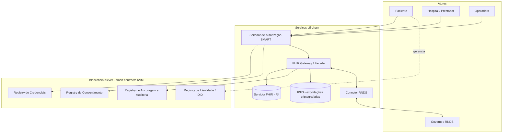
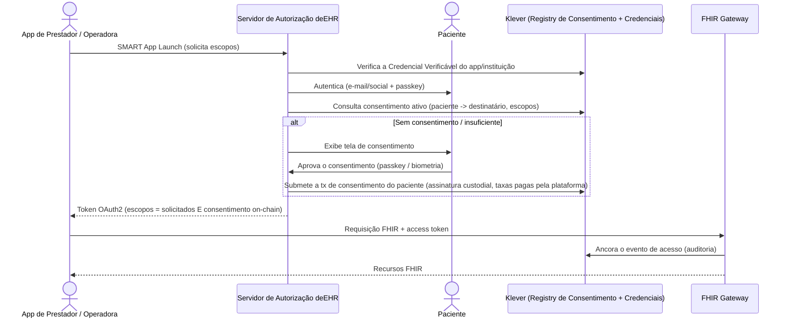

# deEHR — Registro Eletrônico de Saúde Descentralizado

> Uma plataforma open-source de Registro Eletrônico de Saúde na qual **os pacientes realmente são donos dos seus dados de saúde** — construída sobre os padrões **FHIR / SMART**, com autenticidade, consentimento e propriedade dos dados **certificados na blockchain Klever**.


🌐 **Languages / Idiomas:** [English](README.md) · **Português (Brasil)**

> ⚠️ **Status do projeto:** Planejamento inicial. Este README é o documento âncora do projeto e deve evoluir. Arquitetura, escopo e roadmap estão abertos para discussão — veja [Como contribuir](#-como-contribuir).
>
> ℹ️ A documentação canônica é mantida em **inglês** ([README.md](README.md)). Esta é a versão em **Português do Brasil**, mantida via convenção i18n. Em caso de divergência, prevalece a versão em inglês.

---

## Sumário

- [Visão](#-visão)
- [O Problema](#-o-problema)
- [A Abordagem deEHR](#-a-abordagem-deehr)
- [Princípios Fundamentais](#-princípios-fundamentais)
- [Padrões e Blocos de Construção](#-padrões-e-blocos-de-construção)
- [Arquitetura](#-arquitetura)
  - [Off-chain vs. On-chain](#off-chain-vs-on-chain)
  - [Visão Geral do Sistema](#visão-geral-do-sistema)
  - [Identidade e Gestão de Chaves — "Custódia Progressiva"](#identidade-e-gestão-de-chaves--custódia-progressiva)
  - [O que vive na Klever](#o-que-vive-na-klever)
  - [A Ponte SMART ↔ Blockchain](#a-ponte-smart--blockchain)
  - [Armazenamento de Dados — Modelo Híbrido](#armazenamento-de-dados--modelo-híbrido)
- [Atores e Casos de Uso](#-atores-e-casos-de-uso)
- [Integração com a RNDS e Governo](#-integração-com-a-rnds-e-governo)
- [Roadmap](#-roadmap)
- [Como Gerenciamos o Trabalho](#-como-gerenciamos-o-trabalho)
- [Stack Tecnológica](#-stack-tecnológica)
- [Estrutura do Projeto](#-estrutura-do-projeto)
- [Segurança e Conformidade](#-segurança-e-conformidade)
- [Como Contribuir](#-como-contribuir)
- [Licença](#-licença)
- [Referências e Agradecimentos](#-referências-e-agradecimentos)

---

## 🩺 Visão

Hoje os registros de saúde estão espalhados por hospitais, clínicas, laboratórios e operadoras — cada um um silo, nenhum deles pertencente à pessoa de quem os dados realmente são. Quando um paciente troca de prestador, muda de cidade ou precisa de uma segunda opinião, seu histórico raramente o acompanha.

A **deEHR** inverte o modelo de propriedade. O **paciente é o custodiante e dono** do seu registro de saúde. Hospitais, operadoras e sistemas de governo passam a ser *participantes* que leem e escrevem no registro do paciente **somente com consentimento verificável e registrado on-chain**.

Nosso objetivo é uma plataforma open-source de nível produção que seja:

- **Nativa em padrões** — interoperável por design via [HL7 FHIR](https://hl7.org/fhir/) e [SMART App Launch](https://docs.smarthealthit.org/).
- **Ancorada em confiança** — integridade, consentimento e propriedade dos dados certificados na [blockchain Klever](https://ai.klever.org/).
- **Pronta para o governo** — integra-se a backbones nacionais de saúde, começando pela [RNDS](https://rnds-guia.saude.gov.br/) brasileira.
- **Fácil para todos** — incluindo pacientes idosos. Sem jargão cripto, sem seed phrases.

## ❓ O Problema

| Dor | Hoje | Com a deEHR |
| --- | --- | --- |
| **Propriedade** | O dado pertence à instituição que o capturou. | O paciente é dono do registro; instituições são convidadas. |
| **Portabilidade** | O histórico fica preso em sistemas proprietários. | Um registro FHIR portável e criptografado acompanha o paciente. |
| **Consentimento** | Consentimento em papel ou enterrado em termos de uso; difícil auditar ou revogar. | Consentimento é um evento explícito, assinado, revogável e **on-chain**. |
| **Integridade** | Não há como provar que um registro não foi alterado depois. | Todo registro tem seu hash ancorado em um ledger público. |
| **Confiança entre as partes** | Hospitais e operadoras não confiam nos dados uns dos outros. | A autenticidade é verificável criptograficamente por qualquer um. |
| **Interoperabilidade** | Integrações ponto a ponto customizadas por toda parte. | Uma API nativa em FHIR; um modelo de consentimento. |

## 💡 A Abordagem deEHR

A arquitetura segue um princípio confirmado tanto pela pesquisa acadêmica quanto pelos profissionais brasileiros de TI em saúde que moldaram estes requisitos:

> **Informação de Saúde Protegida (PHI) nunca vai para a blockchain.**
> Os recursos **FHIR** criptografados são armazenados **off-chain**. A blockchain guarda apenas **provas**: hashes de integridade, recibos de consentimento, eventos de acesso e registros de identidade/credenciais.

Isso está alinhado com a orientação coletada de um CTO da Amil:

1. *"Aí você anchora e valida o dado on-chain e pode armazenar fora já no formato FHIR."* → **Anchor Registry** + armazenamento FHIR off-chain.
2. *"Precisa de um estudo de como anchorar a identificação e validação da chain com o SMART pra passar os scopes validados pra API."* → A **Ponte SMART ↔ Blockchain** (emissão de token condicionada ao consentimento).
3. *"O SMART faz Auth em cima da OpenID — teria que entender como adicionar a camada on-chain para garantir a autenticidade, certificação e ownership dos dados."* → **Identidade DID + Credenciais Verificáveis + Consent Registry on-chain**.

A deEHR é, até onde sabemos, o primeiro projeto a combinar **autorização SMART on FHIR de nível produção**, **consentimento on-chain como fonte da verdade**, **ancoragem de baixo custo na Klever** e um **backbone nacional real (RNDS)** — mantendo a experiência tão simples quanto a de um aplicativo de consumo comum.

## 🧱 Princípios Fundamentais

1. **Propriedade do paciente por padrão.** O paciente é a raiz do consentimento e da propriedade.
2. **Nenhuma PHI on-chain — jamais.** Um invariante arquitetural rígido, garantido em code review e auditorias.
3. **Padrões acima de invenção.** FHIR R4 e SMART App Launch são o contrato; a blockchain os complementa, não os substitui.
4. **A blockchain é invisível.** Pacientes entram com login social/e-mail + biometria. Sem carteiras, seed phrases ou gas — nunca, a menos que optem por isso.
5. **Consentimento é explícito, assinado e revogável.** Toda concessão e revogação é um evento auditável on-chain.
6. **Open source e auditável.** Licença MIT. Auditoria de segurança é **obrigatória** antes de cada release.
7. **Acessibilidade em primeiro lugar.** Pacientes idosos e com baixa literacia digital são usuários de primeira classe.
8. **Consciente da soberania.** Construída para integrar-se — e não burlar — sistemas nacionais de saúde e a legislação de proteção de dados (LGPD).

## 📚 Padrões e Blocos de Construção

| Bloco de construção | Papel na deEHR | Referência |
| --- | --- | --- |
| **HL7 FHIR R4** | Modelo de dados canônico para todos os registros clínicos. | [hl7.org/fhir](https://hl7.org/fhir/) |
| **SMART App Launch 2.x** | Autorização OAuth2/OIDC para apps e serviços; acesso escopado e de menor privilégio. | [docs.smarthealthit.org](https://docs.smarthealthit.org/) |
| **SMART Backend Services** | Acesso FHIR servidor-a-servidor (instituição ↔ instituição). | [HL7 SMART](https://hl7.org/fhir/smart-app-launch/backend-services.html) |
| **OAuth 2.0 / OpenID Connect** | Framework de autenticação subjacente; `id_token`, claim `fhirUser`. | [oauth.net](https://oauth.net/2/) |
| **WebAuthn / FIDO2 (passkeys)** | Login sem senha e biométrico na plataforma deEHR (um fator de autenticação off-chain). | [w3.org/TR/webauthn](https://www.w3.org/TR/webauthn-2/) |
| **W3C DID e Credenciais Verificáveis** | Identidade descentralizada para pacientes, prestadores e instituições. | [w3.org/TR/did-core](https://www.w3.org/TR/did-core/) |
| **Blockchain Klever (KVM)** | Registries de ancoragem, consentimento, identidade e credenciais via smart contracts Rust/WASM. | [klever.org](https://klever.org/) |
| **IPFS** | Armazenamento descentralizado para exportações criptografadas do registro, sob posse do paciente. | [ipfs.tech](https://ipfs.tech/) |
| **RNDS (Brasil)** | Rede Nacional de Dados em Saúde — primeira integração com backbone de governo. | [rnds-guia.saude.gov.br](https://rnds-guia.saude.gov.br/) |

## 🏗 Arquitetura

### Off-chain vs. On-chain

| Camada | Armazena | Exemplos |
| --- | --- | --- |
| **Off-chain** (criptografado) | Todos os dados clínicos | Recursos FHIR, documentos, resultados de exames, imagens |
| **On-chain** (Klever) | Apenas provas — nunca PHI | Hashes de integridade, concessões/revogações de consentimento, eventos de auditoria de acesso, DIDs, status de credenciais |

### Visão Geral do Sistema



### Identidade e Gestão de Chaves — "Custódia Progressiva"

É aqui que a deEHR é deliberadamente diferente. **A autocustódia com seed phrases é uma barreira**, não um recurso, para pessoas comuns — e pacientes idosos são um público prioritário. A deEHR desacopla *como o paciente faz login* de *como as transações on-chain são assinadas e pagas*, usando um **modelo de chaves custodial por padrão** sobre o **sistema nativo de permissões de conta** da Klever (contas com múltiplos signatários ponderados e limiares):

| Preocupação | Como a deEHR resolve |
| --- | --- |
| **Login** | Login por e-mail ou social (OIDC) + uma **passkey** (WebAuthn/FIDO2). Desbloqueio biométrico. Sem senhas para esquecer, sem seed phrases para perder. A passkey é um **fator de autenticação off-chain** — ela autentica o paciente na plataforma deEHR; não assina transações Klever diretamente. |
| **Conta on-chain** | Uma conta Klever padrão cuja chave de assinatura é, por padrão, **custodiada pela plataforma deEHR** (respaldada por HSM) e nunca exposta ao paciente. As permissões de conta nativas da Klever permitem que o conjunto de signatários e o limiar evoluam ao longo do tempo sem mudar o endereço da conta. |
| **Identidade** | Um DID `did:klever:…` com um DID Document on-chain. O paciente ganha portabilidade e verificabilidade de DID **sem gerenciar nenhuma infraestrutura de DID** ("DID-lite"). |
| **Recuperação** | **Recuperação social** construída sobre as permissões nativas de multiassinatura ponderada da Klever — guardiões (ex.: um familiar, o médico de atenção primária, a plataforma) são registrados como signatários em uma permissão de recuperação com limiar M-de-N (ex.: 2 de 3) para restaurar o acesso em caso de perda do dispositivo. |
| **Chaves de dados** | As chaves de criptografia da PHI também são **respaldadas por guardiões** — perder o celular nunca pode significar perder o registro de saúde. |
| **Taxas** | Pacientes nunca possuem KLV nem pagam gas. A Klever não tem primitiva nativa de transações gasless/meta-transações, então a deEHR opera um **serviço de assinatura e taxas** que submete as transações dos pacientes e cobre as taxas de rede a partir de uma tesouraria da plataforma. |
| **Espectro de custódia** | Padrão = **custódia assistida** (chave sob posse da plataforma + recuperação por guardiões, como um banco). Usuários avançados podem **assumir o controle progressivamente** — adicionando a chave do próprio dispositivo como signatária, reduzindo a permissão da plataforma e, por fim, exportando para uma carteira Klever sob autocustódia. Progressivo, nunca forçado. |

**Efeito líquido:** entrar na deEHR é como entrar em qualquer aplicativo moderno. A blockchain é *infraestrutura invisível* — até que o paciente queira olhar por baixo do capô.

> **Nota de implementação.** A KVM da Klever não oferece account abstraction no estilo ERC-4337, verificação on-chain de assinatura WebAuthn/passkey (secp256r1), guardiões de conta nativos nem transações gasless nativas. A "Custódia Progressiva" da deEHR é, portanto, uma **construção na camada de aplicação** baseada no sistema nativo de permissões de conta (multiassinatura ponderada) da Klever, somado a um serviço de custódia de chaves e de taxas operado pela plataforma. Isso torna esse serviço crítico para a segurança; seu design é especificado na ADR-0001 (Identidade e Gestão de Chaves), estabelecida na Fase 0.

Instituições (hospitais, operadoras) também recebem DIDs, além de **Credenciais Verificáveis** emitidas por autoridades reconhecidas (ex.: CFM/CRM para registros de médicos, ANS para operadoras, CNES para estabelecimentos). São essas credenciais que permitem ao servidor de autorização distinguir um hospital realmente credenciado de um impostor.

### O que vive na Klever

Os smart contracts da Klever são escritos em **Rust** e compilados para **WebAssembly** para a **KVM (Klever Virtual Machine)**. A camada on-chain da deEHR é um conjunto de registries:

| Registry | Responsabilidade |
| --- | --- |
| **Registry de Identidade / DID** | DID Documents, histórico de rotação de chaves, conjuntos de signatários de guardião/recuperação. |
| **Registry de Credenciais** | **Status** de emissão e revogação de Credenciais Verificáveis (apenas hashes — nunca o conteúdo da credencial). |
| **Registry de Consentimento** | Concessões de consentimento assinadas pelo paciente: DID do destinatário, conjunto de escopos, filtro de recursos, finalidade de uso, validade. Cada concessão/revogação é um evento. **Fonte da verdade para autorização.** |
| **Registry de Ancoragem e Auditoria** | Hashes de integridade dos bundles FHIR criptografados + CIDs de IPFS; log à prova de adulteração de todo evento de acesso a dados. |

### A Ponte SMART ↔ Blockchain

A peça inovadora: o **servidor de autorização SMART consulta o Registry de Consentimento on-chain antes de emitir um token OAuth2**, de modo que os escopos emitidos (`patient/Observation.read`, etc.) são *comprovadamente* respaldados pelo consentimento do paciente. A chain certifica autenticidade e propriedade; o SMART/OIDC permanece o padrão que a API fala.



### Armazenamento de Dados — Modelo Híbrido

- **Repositório primário:** um servidor FHIR R4 (plugável; ex.: HAPI FHIR) por custodiante, **criptografado em repouso**. Consultas rápidas, alinhado à RNDS.
- **Exportação sob posse do paciente:** o registro completo do paciente, exportado como um **Bundle FHIR criptografado** e fixado no **IPFS** — portabilidade e propriedade reais. O CID do IPFS é ancorado on-chain.
- **Criptografia:** criptografia em envelope — cada registro é criptografado com uma chave de dados por registro; essa chave é embrulhada para cada parte autorizada. Nenhuma parte lê dados sem uma concessão de consentimento ativa e on-chain.

## 👥 Atores e Casos de Uso

| Ator | Papel | Fluxos principais |
| --- | --- | --- |
| **Paciente** | Dono e custodiante do registro. | Onboarding, ver o histórico completo, conceder/revogar consentimento, exportar o registro, designar guardiões de recuperação. |
| **Hospital / Prestador** | Captura e lê dados clínicos. | Cadastrar-se (com credenciais), escrever recursos FHIR, solicitar acesso condicionado a consentimento, contribuir para o registro longitudinal do paciente. |
| **Operadora** | Cobertura, sinistros e benefícios. | Cadastrar-se, solicitar acesso de divulgação mínima para uma finalidade específica, processar `Claim` / `Coverage` / `ExplanationOfBenefit` FHIR. |
| **Governo / RNDS** | Backbone nacional de interoperabilidade. | Receber e fornecer dados de saúde padronizados via o conector RNDS. |

## 🇧🇷 Integração com a RNDS e Governo

A **Rede Nacional de Dados em Saúde (RNDS)** é o primeiro backbone de governo que a deEHR mira. A integração com a RNDS tem requisitos específicos que a deEHR isola dentro de um módulo dedicado, o **Conector RNDS**:

- **FHIR R4**, RESTful, JSON — com os **perfis FHIR definidos pela RNDS** (e não perfis customizados).
- Autenticação por **certificado digital ICP-Brasil** — o conector autentica contra o componente `EHR Auth` da RNDS (`POST /token`, access tokens com 15 minutos de validade).
- **Homologação** no ambiente sandbox da RNDS antes do acesso em produção.

O design do conector mantém as questões específicas da RNDS (certificados, mapeamento de perfis, o fluxo de autenticação nacional) fora do núcleo da plataforma, de modo que backbones nacionais adicionais possam ser acrescentados depois como conectores irmãos.

## 🗺 Roadmap

O objetivo é provar o **ciclo completo** — Paciente ⇄ Hospital ⇄ Operadora ⇄ RNDS — entregue em fases, mas arquitetado de ponta a ponta desde o primeiro dia.

| Fase | Tema | Destaques |
| --- | --- | --- |
| **0 — Fundações** | Repositório e design | Governança, ADRs, modelagem de ameaças, seleção de perfis FHIR, esqueletos de contrato na devnet Klever, CI/CD, ferramental de segurança. |
| **1 — Núcleo do Paciente** | O paciente é dono do dado | Identidade de custódia progressiva, onboarding do paciente, PHR, FHIR Gateway, registries de Ancoragem + Consentimento, Servidor de Autorização SMART. |
| **2 — Hospital** | Integração de prestador | Onboarding institucional + Credenciais Verificáveis, hospital escreve dados FHIR, acesso de prestador condicionado a consentimento, trilha de auditoria. |
| **3 — Operadora** | Cobertura e sinistros | Onboarding de operadora + credenciais, consentimento por finalidade de uso, acesso de divulgação mínima, fluxos de sinistro/cobertura. |
| **4 — RNDS** | Backbone de governo | Conector RNDS, certificados ICP-Brasil, mapeamento de perfis RNDS, homologação no sandbox. |
| **5 — Endurecimento e Lançamento** | Produção | Auditoria de segurança completa + teste de invasão, ajuste de performance, mainnet Klever, implantação piloto. |

## 🧭 Como Gerenciamos o Trabalho

O trabalho da deEHR é rastreado publicamente no GitHub:

- **Issues** são a unidade atômica de trabalho — todo item planejado, em
  andamento ou adiado vive como uma issue.
- **Milestones** agrupam issues por fase do roadmap. Veja a
  [lista de milestones](https://github.com/brunocampos-ssa/deEHR/milestones),
  começando pela
  [Fase 0 — Fundações](https://github.com/brunocampos-ssa/deEHR/milestone/1)
  e indo até a Fase 5.
- Um **board público "deEHR Roadmap"** em Projects v2 (em configuração —
  veja [#5](https://github.com/brunocampos-ssa/deEHR/issues/5)) oferecerá
  as visões Board e Roadmap em linha do tempo sobre as mesmas issues
  assim que estiver habilitado.
- **Decisões de arquitetura** são capturadas como **ADRs** append-only em
  [`docs/architecture/`](docs/architecture/).

Para contribuir ou propor novos trabalhos, abra uma issue primeiro usando
um dos [modelos de issue](https://github.com/brunocampos-ssa/deEHR/issues/new/choose)
para que possamos discutir antes do código entrar — veja
[Como Contribuir](#-como-contribuir).

## 🛠 Stack Tecnológica

| Área | Escolha | Notas |
| --- | --- | --- |
| **Serviços de backend** | **Go** | FHIR Gateway, Servidor de Autorização SMART, Conector RNDS, relayer de consentimento. Alinhado ao ecossistema do nó Klever; deploys de binário único. |
| **Smart contracts** | **Rust → WASM** | Compilados para a KVM Klever. |
| **Servidor FHIR** | Plugável (ex.: HAPI FHIR) | FHIR R4; roda como componente de infraestrutura por trás do Gateway. |
| **Armazenamento descentralizado** | **IPFS** | Exportações criptografadas do registro, sob posse do paciente. |
| **Autenticação** | OAuth 2.0 / OIDC, SMART App Launch 2.x, WebAuthn/passkeys | Padrões em primeiro lugar. |
| **Frontend** *(fases posteriores)* | TypeScript + React/Next.js (web), React Native (mobile) | Acessibilidade em primeiro lugar; WCAG 2.1 AA. |
| **Infraestrutura** | Docker, Kubernetes, Terraform | GitOps; ambientes reproduzíveis. |
| **CI/CD** | GitHub Actions | Build, testes, lint, scan de segurança, gates de auditoria de smart contract. |

## 📂 Estrutura do Projeto

Layout planejado do monorepo (sujeito a refinamento na Fase 0):

```text
deEHR/
├── README.md                  # Documento canônico (inglês)
├── README.pt-BR.md            # Esta versão em Português do Brasil
├── LICENSE                    # MIT
├── docs/
│   ├── architecture/          # Architecture Decision Records (ADRs)
│   └── pt-BR/                 # Documentação traduzida
├── contracts/                 # Smart contracts Rust/WASM Klever
│   ├── identity-registry/
│   ├── credential-registry/
│   ├── consent-registry/
│   └── anchor-registry/
├── services/                  # Serviços de backend em Go
│   ├── auth-server/           # Servidor de autorização SMART / OIDC
│   ├── fhir-gateway/          # Facade FHIR + ancoragem
│   ├── rnds-connector/        # Integração com a RNDS
│   └── consent-relayer/       # Serviço de assinatura e taxas da plataforma
├── apps/                      # Aplicações para usuário final (fases posteriores)
│   ├── patient-web/
│   ├── patient-mobile/
│   └── provider-portal/
├── packages/                  # Bibliotecas compartilhadas
├── deploy/                    # Docker, Kubernetes, Terraform
└── tools/                     # Ferramental de desenvolvimento e scripts
```

## 🔐 Segurança e Conformidade

Segurança não é uma fase — é um gate em toda mudança.

- **Nenhuma PHI on-chain.** Garantido como invariante rígido em code review e auditorias automatizadas.
- **Auditoria de segurança obrigatória antes de cada release** e antes de cada pull request, usando o ferramental de auditoria de segurança designado pelo projeto.
- **Auditorias de smart contract** para todos os contratos Rust/WASM Klever (reentrância, overflow de inteiros, controle de acesso, questões específicas de WASM).
- **Criptografia em todos os lugares** — TLS em trânsito, criptografia em envelope em repouso, chaves vinculadas ao dispositivo.
- **Modelagem de ameaças** mantida como documento vivo desde a Fase 0.
- **Proteção de dados desde a concepção** — alinhada à **LGPD** brasileira (dado de saúde é dado pessoal sensível) e informada pela HIPAA para prontidão internacional.
- **Auditabilidade** — todo evento de acesso a dados é ancorado em um log on-chain à prova de adulteração.

> Contribuidores: um `SECURITY.md` com a política de divulgação responsável será adicionado na Fase 0.

## 🤝 Como Contribuir

A deEHR é open source e contribuições são bem-vindas — código, expertise em perfis FHIR, revisão de segurança, traduções, testes de acessibilidade e conhecimento de domínio de saúde e seguros.

Este README é intencionalmente um **documento vivo**. A arquitetura acima é uma proposta inicial, moldada por requisitos coletados de profissionais brasileiros de TI em saúde (operadoras e hospitais) e por pesquisa atual; está aberta a questionamento e refinamento. Diretrizes de contribuição (`CONTRIBUTING.md`), um código de conduta e ADRs serão estabelecidos na Fase 0.

**Política de documentação:** a documentação canônica é escrita em **inglês**. Uma versão em **Português do Brasil** é mantida ao lado dela usando uma convenção de sufixo i18n (ex.: `README.pt-BR.md`, `docs/pt-BR/…`) e é sempre referenciada a partir do original em inglês.

## 📄 Licença

Distribuído sob a **Licença MIT**. Veja [LICENSE](LICENSE).

## 🙏 Referências e Agradecimentos

Requisitos e propostas foram coletados de profissionais brasileiros de TI em saúde de operadoras e hospitais. A arquitetura também se apoia em pesquisa pública e referências da indústria:

- SMART Health IT — <https://docs.smarthealthit.org/>
- HL7 FHIR — <https://hl7.org/fhir/>
- HL7 SMART App Launch — <https://hl7.org/fhir/smart-app-launch/>
- Blockchain Klever — <https://klever.org/> · <https://ai.klever.org/>
- RNDS — Guia de Integração — <https://rnds-guia.saude.gov.br/> · FHIR — <https://rnds-fhir.saude.gov.br/>
- SulAmérica na Google Cloud (referência de nuvem para operadora) — <https://cloud.google.com/customers/sulamerica-seguros>
- [FHIRChain / OpenPharma Blockchain on FHIR](https://pmc.ncbi.nlm.nih.gov/articles/PMC9907413/)
- [MediLinker — gestão descentralizada de informação em saúde](https://www.frontiersin.org/journals/big-data/articles/10.3389/fdata.2023.1146023/full)
- [A Patient-Centric Blockchain Framework (arXiv 2511.17464)](https://arxiv.org/abs/2511.17464)
- [Healthchain — EHR preservando privacidade em blockchain (PLOS ONE)](https://journals.plos.org/plosone/article?id=10.1371/journal.pone.0243043)

---

<sub>deEHR — pacientes são donos da própria saúde. Construído com padrões abertos e confiança verificável.</sub>
