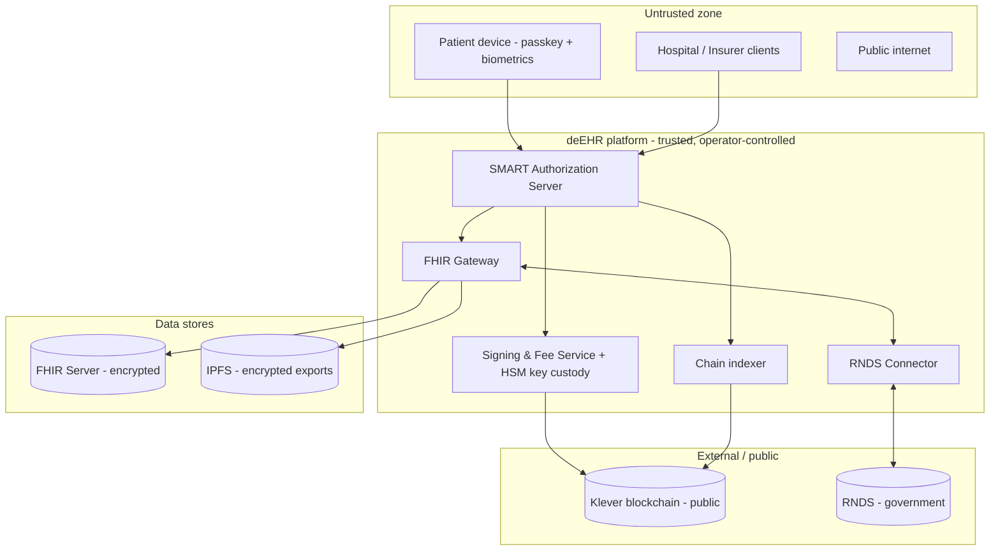

# deEHR Threat Model

- **Status:** Living document — initial draft (Phase 0)
- **Date:** 2026-05-22
- **Owner:** deEHR maintainers

## Purpose and scope

deEHR handles sensitive personal health data. This document identifies the
assets worth protecting, who might attack them, the threats that follow, and
the controls that mitigate those threats. It is a **living document**: it is
revised whenever the architecture changes and reviewed at every phase boundary.

Scope is the full deEHR system as described in the [README](../../README.md):
the platform services, the on-chain layer, FHIR storage, the patient and
institutional clients, and the RNDS integration. It does **not** yet cover a
production deployment topology — that arrives with the production-hardening
phase.

## Methodology

- Threats are enumerated per trust boundary and per component using **STRIDE**
  (Spoofing, Tampering, Repudiation, Information disclosure, Denial of service,
  Elevation of privilege).
- Each threat is paired with **mitigations** and a residual-risk note.
- This draft is qualitative. A scored risk register (likelihood × impact) is an
  open item for the hardening phase.

## System overview and trust boundaries

Trust boundaries (each is an attack surface):

1. **Patient / institutional device → platform** — untrusted endpoints.
2. **Platform → Klever blockchain** — the chain is public and immutable.
3. **Platform → FHIR storage / IPFS** — data at rest.
4. **Platform → RNDS** — a government system with its own auth.
5. **Within the platform → the Signing & Fee Service / HSM** — the highest-value
   internal boundary.

## Assets

| Asset | Sensitivity | Why it matters |
| --- | --- | --- |
| PHI (FHIR resources, documents, images) | Critical | The data subjects' health information; LGPD sensitive personal data. |
| Patient account signing keys (custodied) | Critical | Control of a key allows impersonation and forged consent. |
| Data-encryption keys (envelope keys) | Critical | Unwrap PHI at rest. |
| Consent records (on-chain) | Critical | The source of truth for authorization; integrity is paramount. |
| Identities, DIDs, Verifiable Credentials | High | Trust anchor distinguishing real institutions from impostors. |
| Audit log (on-chain anchor & audit) | High | Tamper-evidence of who accessed what. |
| Fee treasury / KDA pool | High | Funds platform transactions; drain = denial of service. |
| ICP-Brasil certificates (RNDS) | High | National integration credentials. |
| OAuth tokens / sessions | High | Bearer access to FHIR data within granted scope. |

## Threat actors

- **External attacker** — unauthenticated, internet-based.
- **Malicious or compromised institution** — a hospital or insurer (or its
  stolen credentials) seeking data beyond its consent grant.
- **Malicious or negligent platform insider** — an operator with privileged
  access to services, the HSM, or data stores.
- **Compromised patient device** — malware, theft, or a coerced user.
- **Over-reaching legitimate user** — a clinician accessing records without a
  care relationship.

## Threats and mitigations

### A. PHI confidentiality — storage, gateway, exports

| STRIDE | Threat | Mitigations |
| --- | --- | --- |
| I | Direct read of the FHIR store or IPFS exports | Envelope encryption at rest; per-record data keys; encryption keys held separately from ciphertext; least-privilege store access. |
| I | PHI leak via the FHIR Gateway (over-broad responses, verbose errors) | Responses constrained to granted scope; no PHI in logs or error messages; field-level filtering. |
| T | Tampering with stored records | Integrity hashes anchored on-chain (Anchor Registry); verify-on-read. |
| I | PHI in non-production environments | Synthetic data only; hard invariant — no real PHI in the repo or in test/staging. |

### B. Signing & Fee Service and key custody (highest-value target)

The custodial key model (see [ADR-0001](../architecture/adr-0001-identity-and-key-management.md))
makes this the single most critical component.

| STRIDE | Threat | Mitigations |
| --- | --- | --- |
| E / S | Theft of custodied keys → patient impersonation, forged consent | Keys in an HSM / KMS; keys never exported; signing happens inside the HSM boundary; strict service-to-service authn. |
| E | Insider abuse of the signing service | Separation of duties; dual control for sensitive operations; immutable, externally shipped audit logs; alerting on anomalous signing volume. |
| D | Treasury / KDA pool drained by transaction spam | Per-account rate limits and quotas; treasury balance monitoring and alerts; abuse detection. |
| T | Unauthorized transaction submitted on a patient's behalf | Every signing request gated by a verified, fresh patient authentication; request signing and replay protection between platform services. |
| R | Operator denies an action | Append-on-chain audit events; tamper-evident internal logs. |

### C. Consent integrity and authorization

| STRIDE | Threat | Mitigations |
| --- | --- | --- |
| E | Token issued without backing consent (consent-check bypass) | The authorization server MUST query the on-chain Consent Registry before minting a token; deny-by-default; the check is covered by tests and audit. |
| E | Scope escalation — token granted broader scope than consented | Issued scope = intersection of requested scope and active on-chain consent; never the union. |
| T | Forged or altered consent record | Consent writes authorized by the patient's account (via the Signing & Fee Service); on-chain records are tamper-evident. |
| T / I | Stale read — revoked consent still honored | Indexer freshness checks; short token lifetimes; revocation reflected before token issuance; critical reads consult the chain directly. |
| S | Replay of a consent approval | Nonces / expiry on consent approval requests. |

### D. On-chain layer and the no-PHI invariant

| STRIDE | Threat | Mitigations |
| --- | --- | --- |
| I | PHI (or identifying data) written on-chain — **irreversible**: a public, immutable ledger cannot honor an LGPD erasure request | Hard invariant enforced in code review and audit; only hashes, DIDs, CIDs, coded values and status on-chain; CI check for the contract data model. |
| I | Hash of a low-entropy PHI value brute-forced to recover the value | Salt / pepper hashed values; never hash small enumerable fields directly. |
| I | Correlation / metadata analysis of public on-chain activity (who consented to whom, when) | Minimize on-chain identifiers; assess pseudonymization of DIDs; documented residual risk. |
| T | Smart-contract vulnerability — access control, integer overflow, reentrancy, WASM-specific | Mandatory smart-contract audit; least-privilege writes per registry; see [ADR-0002](../architecture/adr-0002-on-chain-registry-design.md). |
| D | Indexer compromised or lagging → wrong authorization decisions | Treat the indexer as security-relevant; freshness/consistency checks; direct-chain fallback for critical reads. |

### E. Identity, credentials, and recovery

| STRIDE | Threat | Mitigations |
| --- | --- | --- |
| S | Impostor institution poses as an accredited hospital/insurer | Verifiable Credentials from recognized authorities (CFM/CRM, ANS, CNES); the authorization server verifies credential status on-chain. |
| E | Social-recovery abuse — collusion of guardians to seize an account | M-of-N threshold; guardian set chosen by the patient; recovery emits an on-chain event; notification + cool-down before recovery completes. |
| S | Stolen patient device used to authenticate | Passkeys are device-bound; biometric unlock; lost-device flow revokes the device credential; recovery re-establishes control. |
| T | DID Document / key-rotation tampering | Rotation authorized by the account; on-chain history is tamper-evident. |

### F. RNDS connector

| STRIDE | Threat | Mitigations |
| --- | --- | --- |
| S / I | Theft or misuse of ICP-Brasil certificates | Certificates stored in the HSM / secret manager; scoped to the connector; rotation procedure; access logged. |
| I | Over-disclosure of PHI to RNDS beyond what is required | RNDS-defined FHIR profiles; minimal-necessary mapping; the connector isolates RNDS concerns from the core. |
| D | RNDS outage degrades deEHR | The connector is an isolated module; failures are contained and retried. |

### G. Platform infrastructure and supply chain

| STRIDE | Threat | Mitigations |
| --- | --- | --- |
| E | Compromised dependency (Go / Rust / npm) | Dependency scanning and pinning; review of new dependencies (P0.5 CI tooling). |
| T | Compromised CI/CD or release artifact | Protected branches; required reviews; the mandatory pre-PR security audit; signed releases (hardening phase). |
| I | Secrets committed to the repository | `.gitignore` for secrets; secret scanning in CI; no real credentials anywhere in the repo. |
| D | Denial of service against public endpoints | Rate limiting; standard network protections (hardening phase). |

## Cross-cutting controls

- **No PHI on-chain — ever.** The defining invariant; structurally simple,
  enforced everywhere.
- **No real PHI in the repository.** Synthetic data only.
- **Encryption everywhere** — TLS in transit, envelope encryption at rest.
- **Least privilege** — per-service, per-registry, per-scope.
- **Deny by default** — no access without an active, verified consent grant.
- **Auditability** — every data-access event anchored to a tamper-evident log.
- **Mandatory security audit** before every pull request and every release;
  smart-contract audit for contract changes.
- **Data protection by design** — aligned with LGPD; informed by HIPAA.

## Residual risks and open items

- **Custodial trust.** Until a patient opts into self-custody, deEHR holds the
  keys; the platform is a point of trust by design. Tracked in
  [ADR-0001](../architecture/adr-0001-identity-and-key-management.md).
- **On-chain metadata correlation.** Even without PHI, public consent/audit
  activity is analyzable; pseudonymization needs design work.
- **LGPD erasure vs. an immutable ledger.** On-chain data cannot be deleted;
  the design relies on keeping only non-personal proofs on-chain — this must be
  reviewed with legal counsel.
- **Indexer as a trust dependency.** Open question carried from
  [ADR-0002](../architecture/adr-0002-on-chain-registry-design.md).
- A **scored risk register** and a **production deployment threat model** are
  deferred to the hardening phase.

## Review and maintenance

- Reviewed at every phase boundary and on any significant architecture change.
- New ADRs that affect security must update this document in the same change.
- Findings from security audits feed back into the threats and mitigations
  above.
