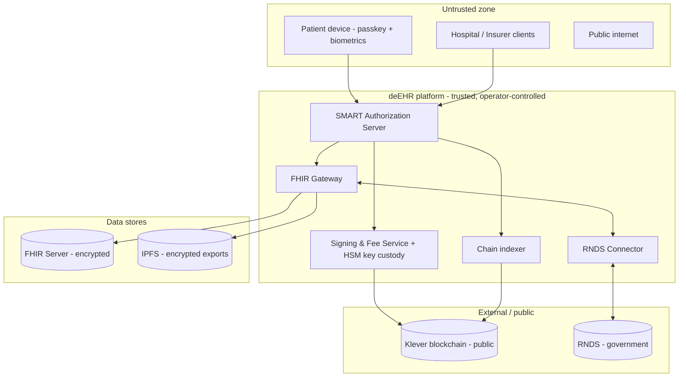

# Modelo de Ameaças — deEHR

🌐 **Languages / Idiomas:** [English](threat-model.md) · **Português (Brasil)**

> ℹ️ A documentação canônica é mantida em **inglês** ([threat-model.md](threat-model.md)). Esta é a versão em **Português do Brasil**, mantida via convenção i18n. Em caso de divergência, prevalece a versão em inglês.

---

- **Status:** Documento vivo — rascunho inicial (Fase 0)
- **Data:** 2026-05-22
- **Owner:** mantenedores da deEHR

## Propósito e escopo

A deEHR lida com dados pessoais sensíveis de saúde. Este documento
identifica os ativos que vale proteger, quem pode atacá-los, as ameaças
decorrentes e os controles que mitigam essas ameaças. É um **documento
vivo**: ele é revisado sempre que a arquitetura muda e reavaliado a cada
fronteira de fase.

O escopo é o sistema deEHR completo, como descrito no
[README](../../README.md): os serviços da plataforma, a camada on-chain,
o armazenamento FHIR, os clientes do paciente e das instituições e a
integração com a RNDS. Ele **ainda não** cobre uma topologia de
implantação em produção — isso chega com a fase de endurecimento para
produção.

## Metodologia

- As ameaças são enumeradas por limite de confiança e por componente
  usando **STRIDE** (Spoofing — falsificação de identidade; Tampering —
  adulteração; Repudiation — repúdio; Information disclosure —
  divulgação de informação; Denial of service — negação de serviço;
  Elevation of privilege — elevação de privilégio).
- Cada ameaça é acompanhada de **mitigações** e de uma nota de risco
  residual.
- Este rascunho é qualitativo. Um registro de riscos pontuado
  (probabilidade × impacto) é um item em aberto para a fase de
  endurecimento.

## Visão geral do sistema e limites de confiança

Limites de confiança (cada um é uma superfície de ataque):

1. **Dispositivo do paciente / instituição → plataforma** — endpoints
   não confiáveis.
2. **Plataforma → blockchain Klever** — a chain é pública e imutável.
3. **Plataforma → armazenamento FHIR / IPFS** — dados em repouso.
4. **Plataforma → RNDS** — um sistema de governo com autenticação
   própria.
5. **Dentro da plataforma → Signing & Fee Service / HSM** — o limite
   interno de maior valor.

## Ativos

| Ativo | Sensibilidade | Por que importa |
| --- | --- | --- |
| PHI (recursos FHIR, documentos, imagens) | Crítico | Informações de saúde do titular dos dados; dado pessoal sensível segundo a LGPD. |
| Chaves de assinatura da conta do paciente (custodiadas) | Crítico | Controle de uma chave permite personificação e consentimento forjado. |
| Chaves de criptografia de dados (chaves de envelope) | Crítico | Desembrulham PHI em repouso. |
| Registros de consentimento (on-chain) | Crítico | Fonte da verdade para autorização; integridade é primordial. |
| Identidades, DIDs, Verifiable Credentials | Alta | Âncora de confiança que distingue instituições reais de impostoras. |
| Log de auditoria (ancoragem on-chain e auditoria) | Alta | Evidência tamper-evident de quem acessou o quê. |
| Tesouraria de taxas / pool de KDA | Alta | Financia transações da plataforma; drenar = denial of service. |
| Certificados ICP-Brasil (RNDS) | Alta | Credenciais de integração nacional. |
| Tokens / sessões OAuth | Alta | Acesso bearer aos dados FHIR dentro do escopo concedido. |

## Atores maliciosos

- **Atacante externo** — não autenticado, baseado na internet.
- **Instituição maliciosa ou comprometida** — um hospital ou operadora
  (ou suas credenciais roubadas) buscando dados além de sua concessão
  de consentimento.
- **Insider malicioso ou negligente da plataforma** — um operador com
  acesso privilegiado a serviços, ao HSM ou aos data stores.
- **Dispositivo do paciente comprometido** — malware, roubo ou usuário
  coagido.
- **Usuário legítimo extrapolando o escopo** — um clínico acessando
  registros sem relação de cuidado.

## Ameaças e mitigações

### A. Confidencialidade da PHI — storage, gateway, exportações

| STRIDE | Ameaça | Mitigações |
| --- | --- | --- |
| I | Leitura direta do FHIR store ou das exportações no IPFS | Criptografia em envelope em repouso; chaves de dados por registro; chaves de criptografia armazenadas separadamente do ciphertext; acesso de menor privilégio ao store. |
| I | Vazamento de PHI via FHIR Gateway (respostas amplas demais, mensagens de erro verbosas) | Respostas restritas ao escopo concedido; sem PHI em logs ou mensagens de erro; filtragem em nível de campo. |
| T | Adulteração de registros armazenados | Hashes de integridade ancorados on-chain (Anchor Registry); verify-on-read. |
| I | PHI em ambientes que não são de produção | Apenas dados sintéticos; invariante rígido — nenhuma PHI real no repositório nem em test/staging. |

### B. Signing & Fee Service e custódia de chaves (alvo de maior valor)

O modelo custodial de chaves (veja
[ADR-0001](../architecture/adr-0001-identity-and-key-management.pt-BR.md))
faz deste o componente mais crítico de todos.

| STRIDE | Ameaça | Mitigações |
| --- | --- | --- |
| E / S | Roubo de chaves custodiadas → personificação do paciente, consentimento forjado | Chaves em HSM / KMS; chaves nunca são exportadas; a assinatura ocorre dentro do limite do HSM; autenticação estrita entre serviços. |
| E | Abuso de insider sobre o serviço de assinatura | Segregação de funções; controle duplo para operações sensíveis; logs de auditoria imutáveis e enviados externamente; alertas em volume anômalo de assinaturas. |
| D | Tesouraria / pool de KDA drenado por spam de transações | Limites de taxa e cotas por conta; monitoramento e alertas de saldo da tesouraria; detecção de abuso. |
| T | Transação não autorizada submetida em nome de um paciente | Toda requisição de assinatura é condicionada a uma autenticação verificada e recente do paciente; assinatura de requisições e proteção contra ataque de replay entre os serviços da plataforma. |
| R | Operador nega uma ação | Eventos de auditoria append-on-chain; logs internos tamper-evident. |

### C. Integridade do consentimento e autorização

| STRIDE | Ameaça | Mitigações |
| --- | --- | --- |
| E | Token emitido sem consentimento de respaldo (bypass da checagem de consentimento) | O authorization server DEVE consultar o Consent Registry on-chain antes de emitir um token; deny-by-default; a checagem é coberta por testes e auditoria. |
| E | Escalonamento de escopo — token concedido com escopo mais amplo do que o consentido | Escopo emitido = interseção do escopo solicitado com o consentimento on-chain ativo; nunca a união. |
| T | Registro de consentimento forjado ou alterado | Escritas de consentimento autorizadas pela conta do paciente (via o Signing & Fee Service); registros on-chain são tamper-evident. |
| T / I | Leitura desatualizada — consentimento revogado ainda honrado | Checagens de frescor do indexador; tokens com tempo de vida curto; revogação refletida antes da emissão do token; leituras críticas consultam a chain diretamente. |
| S | Replay de uma aprovação de consentimento | Nonces / expiração em requisições de aprovação de consentimento. |

### D. Camada on-chain e o invariante de "nenhuma PHI on-chain"

| STRIDE | Ameaça | Mitigações |
| --- | --- | --- |
| I | PHI (ou dado identificável) escrito on-chain — **irreversível**: um ledger público e imutável não consegue honrar um pedido de apagamento sob a LGPD | Invariante rígido garantido em code review e auditoria; apenas hashes, DIDs, CIDs, valores codificados e status on-chain; checagem em CI sobre o modelo de dados dos contratos. |
| I | Hash de um valor de PHI de baixa entropia é submetido a brute-force para recuperar o valor | Salt / pepper em valores que sofrem hash; nunca aplicar hash diretamente a campos enumeráveis pequenos. |
| I | Correlação / análise de metadados da atividade on-chain pública (quem consentiu para quem, quando) | Minimizar identificadores on-chain; avaliar pseudonimização de DIDs; risco residual documentado. |
| T | Vulnerabilidade de smart contract — controle de acesso, overflow de inteiros, reentrância, questões específicas de WASM | Auditoria de smart contract obrigatória; escritas de menor privilégio por registry; veja [ADR-0002](../architecture/adr-0002-on-chain-registry-design.pt-BR.md). |
| D | Indexador comprometido ou atrasado → decisões de autorização incorretas | Tratar o indexador como relevante para segurança; checagens de frescor/consistência; fallback de leitura direta na chain para leituras críticas. |

### E. Identidade, credenciais e recuperação

| STRIDE | Ameaça | Mitigações |
| --- | --- | --- |
| S | Instituição impostora se passa por hospital/operadora credenciada | Verifiable Credentials emitidas por autoridades reconhecidas (CFM/CRM, ANS, CNES); o authorization server verifica o status da credencial on-chain. |
| E | Abuso de recuperação social — conluio de guardiões para tomar conta de uma conta | Threshold M-de-N; conjunto de guardiões escolhido pelo paciente; recuperação emite evento on-chain; notificação + período de carência (cool-down) antes da recuperação ser concluída. |
| S | Dispositivo de paciente roubado usado para autenticar | Passkeys são vinculadas ao dispositivo; desbloqueio biométrico; fluxo de dispositivo perdido revoga a credencial do dispositivo; recuperação restabelece o controle. |
| T | Adulteração de DID Document / rotação de chaves | Rotação autorizada pela conta; histórico on-chain é tamper-evident. |

### F. RNDS Connector

| STRIDE | Ameaça | Mitigações |
| --- | --- | --- |
| S / I | Roubo ou uso indevido de certificados ICP-Brasil | Certificados em HSM / secret manager; escopados ao connector; procedimento de rotação; acessos logados. |
| I | Sobre-divulgação de PHI para a RNDS além do necessário | Perfis FHIR definidos pela RNDS; mapeamento minimamente necessário; o connector isola as questões da RNDS do núcleo. |
| D | Indisponibilidade da RNDS degrada a deEHR | O connector é um módulo isolado; falhas são contidas e retentadas. |

### G. Infraestrutura da plataforma e cadeia de suprimentos

| STRIDE | Ameaça | Mitigações |
| --- | --- | --- |
| E | Dependência comprometida (Go / Rust / npm) | Scanning de dependências e pinning; revisão de novas dependências (ferramental de CI P0.5). |
| T | CI/CD comprometido ou artefato de release adulterado | Branches protegidas; reviews obrigatórias; auditoria de segurança pré-PR obrigatória; releases assinados (fase de endurecimento). |
| I | Secrets commitados no repositório | `.gitignore` para secrets; secret scanning na CI; sem credenciais reais em qualquer parte do repositório. |
| D | Denial of service contra endpoints públicos | Rate limiting; proteções de rede padrão (fase de endurecimento). |

## Controles transversais

- **Nenhuma PHI on-chain — jamais.** O invariante definidor;
  estruturalmente simples, garantido em todos os lugares.
- **Nenhuma PHI real no repositório.** Apenas dados sintéticos.
- **Criptografia em todos os lugares** — TLS em trânsito, criptografia
  em envelope em repouso.
- **Menor privilégio** — por serviço, por registry, por escopo.
- **Deny by default** — sem acesso sem uma concessão de consentimento
  ativa e verificada.
- **Auditabilidade** — todo evento de acesso a dados ancorado em um log
  tamper-evident.
- **Auditoria de segurança obrigatória** antes de cada pull request e
  cada release; auditoria de smart contract para mudanças em contratos.
- **Proteção de dados desde a concepção** — alinhada à LGPD; informada
  pela HIPAA.

## Riscos residuais e itens em aberto

- **Confiança custodial.** Até que o paciente opte pela autocustódia, a
  deEHR detém as chaves; a plataforma é, por design, um ponto de
  confiança. Rastreada em
  [ADR-0001](../architecture/adr-0001-identity-and-key-management.pt-BR.md).
- **Correlação de metadados on-chain.** Mesmo sem PHI, a atividade
  pública de consentimento/auditoria é analisável; a pseudonimização
  precisa de trabalho de design.
- **Apagamento sob a LGPD vs. ledger imutável.** Dados on-chain não
  podem ser deletados; o design depende de manter apenas provas
  não-pessoais on-chain — isso precisa ser revisado com assessoria
  jurídica.
- **Indexador como dependência de confiança.** Questão em aberto
  herdada da
  [ADR-0002](../architecture/adr-0002-on-chain-registry-design.pt-BR.md).
- Um **registro de riscos pontuado** e um **modelo de ameaças de
  implantação em produção** estão postergados para a fase de
  endurecimento.

## Revisão e manutenção

- Revisado a cada fronteira de fase e em qualquer mudança arquitetural
  significativa.
- Novos ADRs que afetem segurança devem atualizar este documento na
  mesma mudança.
- Achados de auditorias de segurança realimentam as ameaças e
  mitigações acima.
